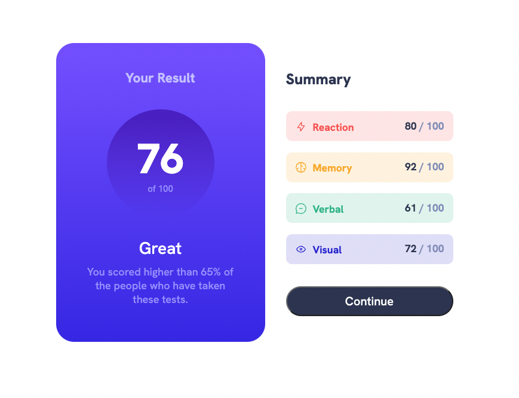
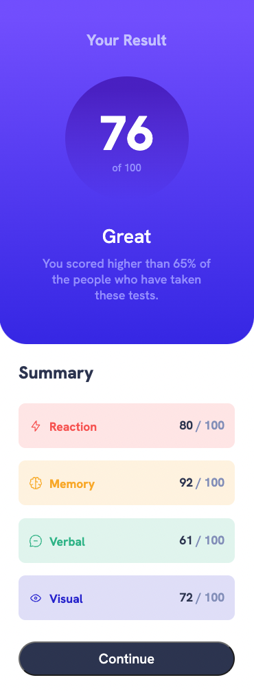

# Frontend Mentor - Results summary component solution

This is a solution to the [Results summary component challenge on Frontend Mentor](https://www.frontendmentor.io/challenges/results-summary-component-CE_K6s0maV). Frontend Mentor challenges help you improve your coding skills by building realistic projects.

## Table of contents

- [Overview](#overview)
  - [The challenge](#the-challenge)
  - [Screenshot](#screenshot)
  - [Links](#links)
- [My process](#my-process)
  - [Built with](#built-with)
- [Author](#author)
- [Acknowledgments](#acknowledgments)

## Overview

### The challenge

Users should be able to:

- View the optimal layout for the interface depending on their device's screen size
- See hover and focus states for all interactive elements on the page

### Screenshot

### Links

- Solution URL: [Frontend Mentor](https://www.frontendmentor.io/solutions/results-summary-component-with-css-and-flexbox-GJjsSe5HWC)
- Live Site URL: [GitHub Pages](https://alexr6667.github.io/Results-Summary-Component/)

### Built with

- HTML5
- CSS
- Flexbox

## Author

- Frontend Mentor - [@Alexr6667](https://www.frontendmentor.io/profile/Alexr6667)
- GitHub - [@Alexr6667](https://github.com/Alexr6667)
